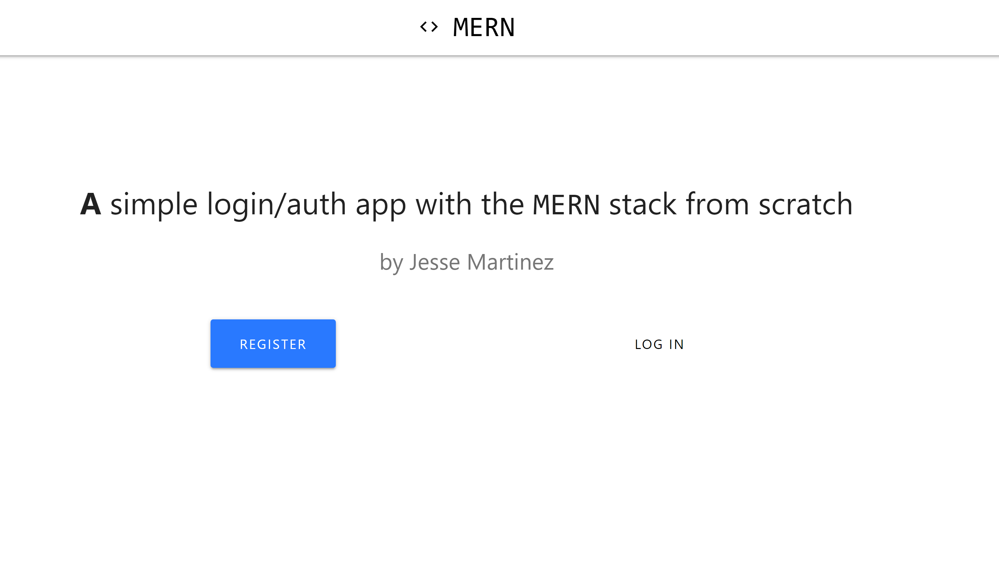
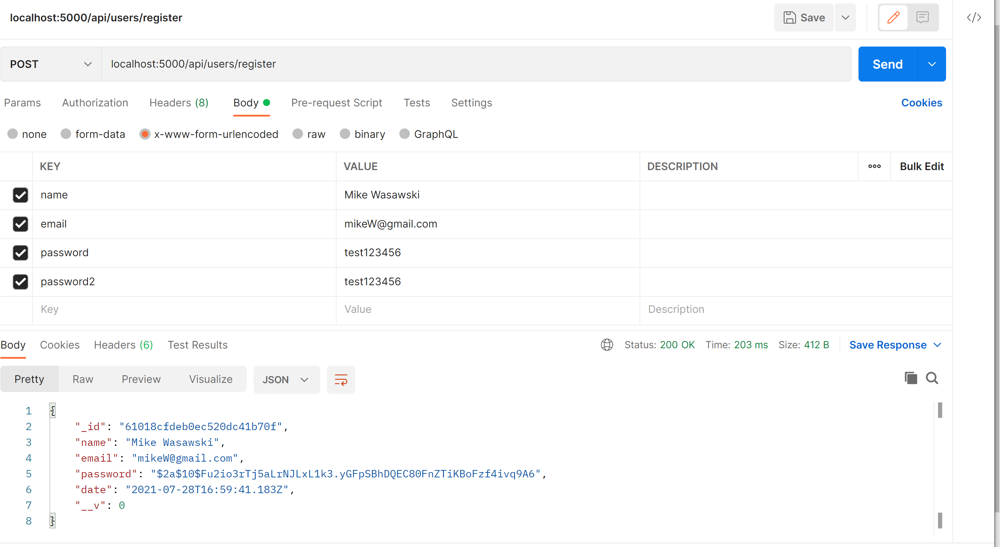
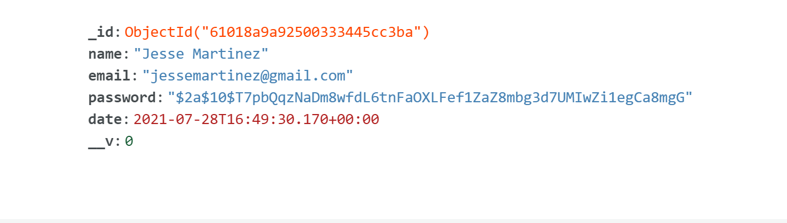
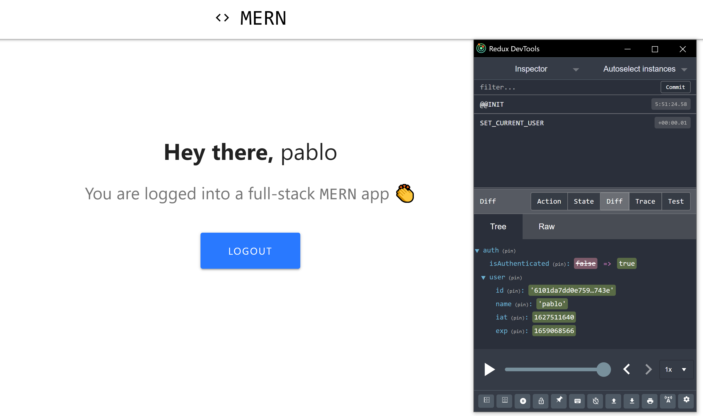

# MERN Authentication Login APP

# Technologies Used
 ✔️ React.js \
  ✔️ Redux \
  ✔️ MongoDB \
  ✔️ HTML \
  ✔️ Express.js \
  ✔️ Node.js 
  
### This Application requires the user to register for an account & requires a login after a succesful login

### After a successful registration the data is sent to MongoDB and stored. Password are encrypted.

# Following registration, user is presented with a logged in page and can log out after

User stays logged in after leaving page and refreshing page because of the use of JWT Tokens (Which can also expire after a set time).

